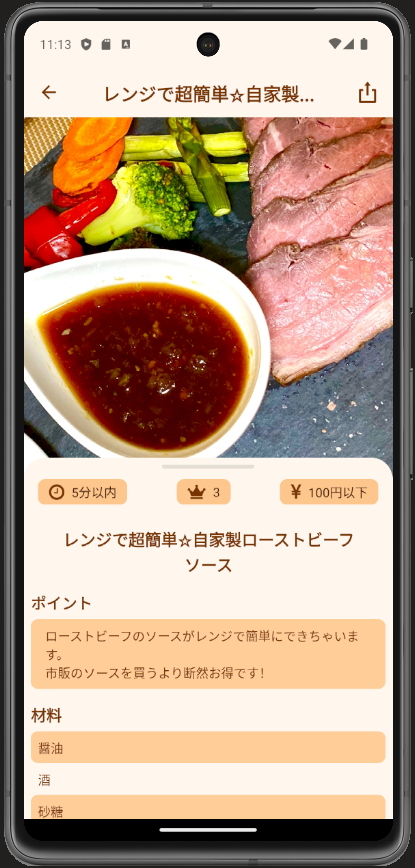

# Recipe Ranking
A mobile application for top cooking recipes made with React Native

## Table of contents

- [Overview](#overview)
  - [Links](#links)
  - [Video](#video)
  - [Screenshot](#screenshot)
- [Built with](#built-with)
- [My process](#my-process)
- [Blog articles](#blog-articles)
- [Author](#author)

## Overview

### Links

- Android APK file: [recipe-ranking.apk](./recipe-ranking.apk)

### Video

https://github.com/rashidshamloo/recipe-ranking/assets/121501991/d5faacee-4fa9-4593-a44b-46a78ad245cc

### Screenshot

   
   

## Built with

- [TypeScript](https://www.typescriptlang.org/)
- [React](https://react.dev/)
- [React Native](https://reactnative.dev/)
- [Expo](https://expo.dev/)
- [NativeWind](https://www.nativewind.dev/)
- [Tailwind CSS](https://tailwindcss.com/)
- [RTK Query](https://redux-toolkit.js.org/rtk-query/overview)
- [Zod](https://zod.dev/)

## My process

I made this application using React Native. It helped me learn more about React Native and its toolchain like Expo, Expo Router, EAS Build, and more. I was surprised by the similarity and how much of my React knowledge I could directly apply to making native mobile applications. there were of course some differences and nuances but overall it went rather smoothly and I had fun playing around with the different elements offered by React Native like FlatList, ActivityIndicator, Modal, RefreshControl, etc.

For styling, I used NativeWind. It's a library that lets you use Tailwind-like syntax for styling your elements in React Native and makes the styling process easier and faster, especially if you've worked with Tailwind before like me.

For extra functionalities, I used the tools and libraries I've used before like Redux Toolkit for state management and Zod for API response validation. they all work the same way they do on the web.

I also learned and used RTK Query instead of Redux Thunk which I used in my previous projects. It was much easier to set up and use, reduced the required boilerplate code by a huge amount, and allowed for easier error handling and loading state management. In my future projects, I will continue to use RTK Query.

I also wrote a blog post detailing the setup process and the steps you need to take to set up your own development environment so you can start making your own application using React Native. You can check it out here:

[React Native setup with Expo Router, NativeWind, and TypeScript](https://dev.to/rashidshamloo/react-native-setup-with-expo-router-nativewind-and-typescript-27ba)

For the backend API, I used the Recipe Ranking API offered by Rakuten because that was the only Japanese recipe API I could find. It gives a number of categories and 4 top recipes for each category but doesn't have a search endpoint or even the detailed cooking process in the response. I extracted and showed as much information as possible from the API response but I couldn't implement the search functionality using it. If I find an API in the future that supports searching, I will replace the API and add the search functionality.

The build process was also interesting. to build a ".apk" file I had to use EAS build which is a service provided by Expo that builds your application in the cloud and gives you the final ".apk" file. there were some extra steps I needed to take for the build process to work like installing extra packages, setting the app icon, modifying various config files, and re-defining the environment variables in the EAS config file. but the Expo documentation was really good and I could build the ".apk" file successfully in the end. You can download and install the ".apk" file on your Android device using the link below:

> I understand if you don't want to install random ".apk" files for security reasons.

[recipe-ranking.apk](recipe-ranking.apk)

In my next React Native application I will try to add user authentication and database integration using Supabase or a similar service.

## Blog articles

I have documented my setup process in this article:
- [React Native setup with Expo Router, NativeWind, and TypeScript](https://dev.to/rashidshamloo/react-native-setup-with-expo-router-nativewind-and-typescript-27ba)

## Author

Rashid Shamloo

- Portfolio - [rashidshamloo.ir](https://www.rashidshamloo.com)
- Linkedin - [rashid-shamloo](https://www.linkedin.com/in/rashid-shamloo/)
- Dev.to - [@rashidshamloo](https://dev.to/rashidshamloo)
- Twitter - [@rashidshamloo](https://www.twitter.com/rashidshamloo)
